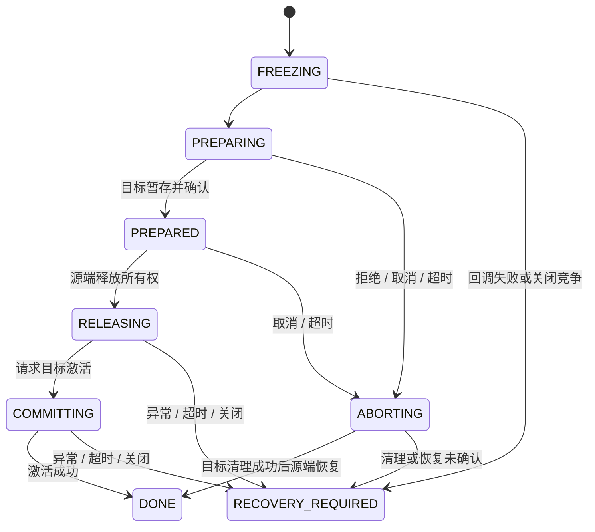

# Actor、场景迁移与对象管理（P2）

本阶段提供进程内能力。运行完整示例：

```powershell
java -jar game-demo/target/game-demo-0.1.0-SNAPSHOT.jar --zone
```

示例在两个 Actor 上创建 ObjectManager，通过 ComponentFactory 的配置创建玩家组件；
用 zfoo 事件增加金币，从源场景迁移到目标场景，再投递一次事件，最后停止两个 Actor。
预期结果为源场景 0 个对象、目标场景 1 个对象、金币 108、停止后订阅数 0。
业务接入代码见 game-demo/src/main/java/io/gameframe/demo/ZoneDemo.java。

## Actor 生命周期和监督

ActorOptions 可指定 Lifecycle 和 FailurePolicy：
- onStart、onFailure、onStop 均在所属 Actor 上执行；生命周期不占普通邮箱槽位。
- started() 表达启动成功/失败。启动失败始终停止 Actor，不能继续处理业务命令。
- CONTINUE 在单条消息失败后继续；STOP 拒绝后续排队消息、取消预留外部回调，然后执行 onStop。
- onFailure 自身失败也会停止 Actor。onStop 失败由 stopped() 异常和 stats 暴露。
- 手动 stop() 幂等，拒绝新消息，排空已接受的普通命令；无论配置哪种 FailurePolicy 都如此。
- 停止时取消尚未转换为命令的 pipe 回调预留，不会中断其外部 I/O。已经入队的回调属于已接受命令。
- stopped() 完成前已从注册表移除，可用同 ID 创建新 Actor；新 Actor 是不同的身份。
- 重建由业务工厂加载持久化状态，不自动重放旧消息或带副作用命令。

禁止在 Actor 内 get/join 等待另一个 Actor 或自身结果。ActorSystem.close() 禁止从 Actor 内调用。
系统关闭最多等待 10 秒，超时报告错误并尝试中断工作线程；无法强制结束忽略中断的业务代码。
普通工作线程不是 daemon，必须正确关闭应用资源。

stats() 包含排队命令与预留回调总数、容量、接受/拒绝、已处理数、失败及耗时。
正在运行的消息不占邮箱槽位；loadCandidates() 按待处理比例排序并排除停止中的 Actor，
不代表 CPU 利用率，也不会自动执行负载迁移。单条业务完成前更新处理指标。
统计是逐 Actor 快照，不是全系统同一时刻的事务快照。

## 共享定时器

一个应用显式创建 SharedTickScheduler(threadCount, maxTasks, name)，多个 FixedStepLoop 共享它。
默认 FixedStepLoop 构造函数保留进程级便利实例；正式应用建议显式管理调度器生命周期。
调度间隔最小 1ms。容量耗尽或关闭后注册立即拒绝；异常任务被取消并留下错误统计。
取消句柄和关闭调度器都幂等，已开始的回调可以结束；需要等待线程退出时调用 awaitTermination。

定时线程只唤醒 Actor。FixedStepLoop 合并未完成的唤醒、限制补帧数；
邮箱拒绝时记录指标并在下一轮尝试，模拟回调异常时取消该循环，Actor 停止后也取消循环。
超过 maxCatchUp 的时间债务被丢弃并计入 skippedSteps。确定性竞技应由玩法定义停顿或降载策略。
建议先关闭循环和业务入口，再排空/停止 Actor，最后关闭共享调度器。

## 迁移协议与失败边界

ZoneTransferCoordinator 管理有界的迁移记录、载荷大小和场景注册数量。
同一实体只能有一条未结束记录，包括等待人工恢复的记录。
begin 必须在源 Actor 内调用；快照编码与 freeze 应在同一条源 Actor 消息里连续执行。
未知场景、非法载荷、重复迁移、容量不足均在冻结前拒绝。



业务 Zone 接口负责实际对象变化：
1. freeze 校验源端归属，冻结模拟、命令、事件以及会修改快照的路径。
2. prepare 在目标 Actor 暂存数据或构造非活跃对象，不能提前参与场景。
3. release 在源 Actor 移除对象及归属；成功返回后才能请求目标 commit。
4. commit 激活目标对象，cancel 幂等清理目标暂存，resume 恢复仍在源端的冻结对象。

所有业务钩子均在对应 Actor 上调用，要求短小、同步完成。实现必须遵守冻结/暂存约定；
协调器无法阻止业务绕开接口修改对象。release 或 commit 即使抛异常也可能已经修改状态，
因此不会盲目执行恢复源端、自动重试或重放。

结果 accepted() 仅在目标激活成功后为 true。确认消息由内部完成回调驱动，
重复或晚到确认无法二次释放源端。本阶段没有网络 ACK 和跨进程可靠传输。

超时使用单调时间。准备阶段到期先进入 ABORTING，目标 Actor 顺序清理后才恢复源端，
TIMEOUT 结果在回滚确认后完成。**deadline 不能抢占阻塞的 Java 业务钩子，也不是结果 Future 的硬完成时限**：
阻塞 Actor 会让 ABORTING 继续占用有界槽位，可用 pendingTransfers()/phase() 查看。
释放/提交阶段到期返回 RECOVERY_REQUIRED，保留记录和实体锁；迟到结果不能开启下一阶段。
已经开始执行的 release/commit 可能继续结束，因此需要等待它们静止后核对两端状态。

RECOVERY_REQUIRED 的记录、错误和原始快照可查询。业务完成归属核对、补偿/持久化后，
显式 acknowledgeRecovery；执行中仍有回调时拒绝确认。此 API 本身不会修复任何对象。
恢复记录目前只在内存中；进程崩溃后的恢复、租约 fencing、跨进程迁移归 P3/P5。
close() 发起取消，不阻塞等待；关闭应用时应先排空迁移，再关闭场景 Actor，并检查遗留恢复记录。

迁移结果的完成线程不属于业务承诺。要修改 Actor 状态，应重新投递或使用 pipe 预留回调容量，
并给迁移控制消息预留足够邮箱空间；禁止直接在任意 whenComplete 中访问场景对象。

## zfoo 事件和订阅作用域

ActorEvents 直接使用项目内 zfoo EventBus；本地 EventBus 新增按接收器身份注销，
注册表改为 ConcurrentHashMap + CopyOnWriteArrayList，支持并发注册、发布和注销。
原有 CurrentThread/AsyncThread 接口保留。新增桥接订阅只使用 CurrentThread 做入队，
实际监听器在目标 Actor 执行，不进入 zfoo 的无界异步队列。

ActorEvents 的总订阅数有上限，投递受到 Actor 邮箱容量限制；拒绝、失败、成功和关闭后丢弃均有指标。
事件必须是不可变载荷；框架不会深拷贝任意 IEvent。事件分发按精确 Class 匹配，
可在 Actor 内按对象 ID 过滤。高频海量实体事件应做业务路由，避免向所有同类订阅扇出。
这是通知接口，没有持久化、自动重试或可靠送达承诺；关键交易必须使用显式业务命令。

GameObject.events(bus) 的订阅在对象 close 时注销；
GameComponent.events(bus) 的订阅在 detach、挂载回滚时注销，包括业务 onDetach 抛错的情况。
手动订阅可用 Scope 或 Subscription.close 提前释放。关闭会阻止尚未开始的排队回调；
已经执行中的监听器可以结束。对象/组件在所属 Actor 内关闭时，其回调与关闭天然串行。

## 配置工厂和 ObjectManager

ComponentFactory 复用 game-base.Factory，Spec 包含 typeId 和不可变字符串配置。
校验工厂返回值的类型和 detached 状态，禁止错误类型或复用已挂载组件。
配置语义由各组件构造器解析和校验，当前没有通用配置文件加载器。

ObjectManager 复用 game-base.ObjectRegistry，所有访问限于所属 Actor。
创建前检查容量、ID、组件主类型槽；完整挂载后才注册对象。
构造失败会清理此前挂载的组件，close 会清理所有对象并聚合异常。
工厂或生命周期回调中的递归管理器修改会被拒绝。
由管理器创建的对象应通过管理器 remove/close 释放，避免注册表中残留已关闭对象。
在 Actor.onStop 中调用 ObjectManager.close；ZoneDemo 展示了完整接法。
